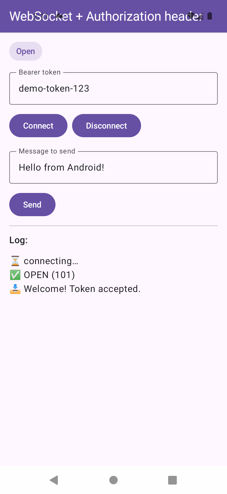
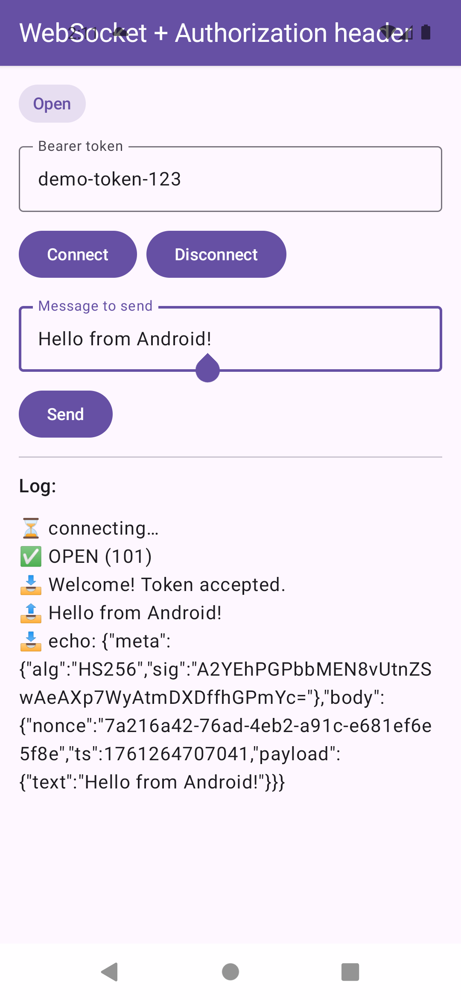
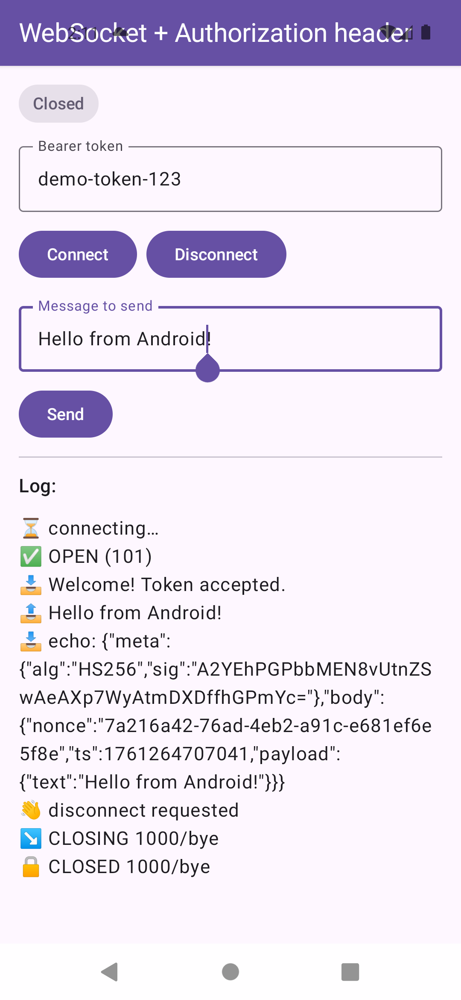

# 🛰️ WebSocketInterceptor Android App

This Android project demonstrates a **secure and modular WebSocket connection system** using Kotlin, Jetpack Compose, and **Koin** dependency injection.  
It connects to a FastAPI WebSocket backend, automatically injecting authorization headers during the HTTP handshake — much like how an **interceptor** would work in REST clients.

<table>
  <tr>
    <td align="center"><br/>Connected state</td>
    <td align="center"><br/>Sending messages</td>
    <td align="center"><br/>Disconnected state</td>
  </tr>
</table>

## 📁 Project Structure

```
app/
 ├── di/
 │    └── AppModule.kt        # Defines app-level dependencies (TokenProvider, MainViewModel)
 ├── providers/
 │    └── AuthStore.kt        # Holds and manages current access token
 ├── ui/
 │    ├── presentation/
 │    │     ├── MainActivity.kt  # Compose UI with connect/send/disconnect controls
 │    │     └── MainViewModel.kt # Binds UI with WebSocket client events
 │    └── theme/               # App theme setup
 └── App.kt                    # Application entrypoint (Koin initialization)

wssecure/
 ├── client/
 │    └── WsClient.kt          # Core WebSocket client using OkHttp
 ├── data/
 │    ├── envelope/
 │    │     ├── WsEnvelopeSigner.kt   # Interface for message signing
 │    │     └── HmacEnvelopeSigner.kt # Example signer using token-based HMAC
 │    ├── model/
 │    │     └── WsConfig.kt           # Config values (URL, timeouts, retries)
 │    ├── plugin/
 │    │     ├── WsPlugin.kt           # Base plugin contract
 │    │     ├── AuthorizationHeaderPlugin.kt  # Adds Bearer token to handshake
 │    │     └── QueryTokenPlugin.kt            # Adds token via query param
 │    └── provider/
 │          └── TokenProvider.kt      # Abstracts how tokens are fetched
 ├── di/
 │    └── WsSecureModule.kt           # Provides default DI bindings for the library
 ├── presentation/events/
 │    └── WsEvent.kt                  # WebSocket event wrapper
 └── Constants.kt                     # Global constants (BASE_URL, etc.)
```

## 🧩 Dependency Injection (Koin)

The app uses **Koin** to provide dependencies from both modules:

- `WsSecureModule` (library): builds a configurable WebSocket client with OkHttp, plugins, and optional signing.
- `AppModule` (app): defines how tokens are fetched (`TokenProvider`) and injects the `MainViewModel`.

Example:
```kotlin
val AppModule = module {
    single<TokenProvider> {
        object : TokenProvider {
            override fun token() = AuthStore.currentAccessToken
        }
    }
    viewModel { MainViewModel(get()) }
}
```

All DI modules are started in your custom `App.kt`:
```kotlin
class App : Application() {
    override fun onCreate() {
        super.onCreate()
        startKoin {
            modules(WsSecureModule, AppModule)
        }
    }
}
```

## 🧠 How the Interceptor Works

Unlike HTTP interceptors, a **WebSocket handshake** can only include headers or query parameters *before* switching protocols.  
Here, that’s achieved using the **plugin system**:

1. `AuthorizationHeaderPlugin` injects `Authorization: Bearer <token>` into the HTTP upgrade request.  
2. Once the server replies with `101 Switching Protocols`, the connection upgrades to the WebSocket protocol.
3. After the switch, `WsClient` manages message sending and event flow (`open`, `message`, `closed`, `failure`).

This approach lets client apps **extend or replace** the default plugins — e.g., to add logging, encryption, or custom authentication.

## 💬 UI Overview

The app’s main screen (built with **Jetpack Compose**) provides:
- A text field to input a token.
- Buttons to **Connect**, **Send**, and **Disconnect**.
- A live **log view** that reflects WebSocket events from the `WsClient`.

## 🧰 Tech Stack

- **Kotlin 2.0+**
- **Jetpack Compose + Material 3**
- **OkHttp 5.2.0** (for WebSocket)
- **Koin 3.5+** (for DI)
- **FastAPI + Uvicorn** backend for local testing (see [here](https://github.com/carlosjimz87/WebSocketInterceptor))

## 🚀 Running the App

1. Once your backend API is running locally (see [here](https://github.com/carlosjimz87/WebSocketInterceptor))

2. Open the Android app on an emulator and enter your demo token (e.g. `demo-token-123`) and tap **Connect**.

3. You should see:
   ```
   ✅ OPEN (code=101)
   📥 Welcome! Token accepted.
   ```
4. Tap **Send** to send a test message, and observe the echoed response with the envelope signature.

5. Tap **Disconnect** to close the connection.

## 🧱 Tips for Integration

- Use **`TokenProvider`** to integrate your app’s real auth system (e.g., Firebase, OAuth).  
- Extend **`WsPlugin`** to add logging, retry, or analytics.  
- If your server uses SSL (`wss://`), make sure to configure trusted certificates or use SSL pinning.

## 📄 License

This project is open source.
